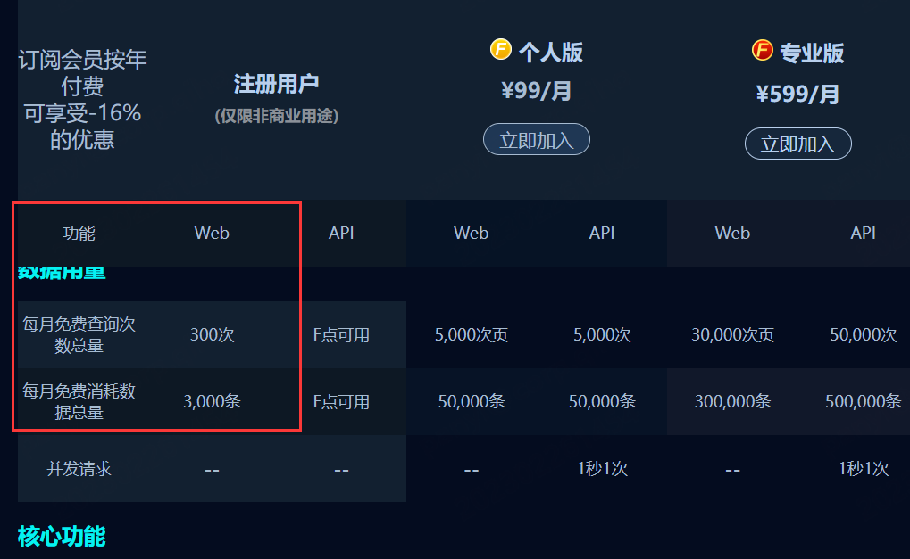

# Fofa-hack

### 简介

`2023-2-26`因FOFA对于普通用户的限制,停止该项目的更新

结论是 `FOFA-Hack` 对于普通用户每个月最多能获取到3000条数据,在这个数据量内该项目是有效的

不过对我来说这样 `FOFA-Hack` 的存在就没有意义了,所以在没有找到更好的方式之前,该项目不会再进行更新

原来的[README](./OLD_README.md)此处查看

### 赞赏列表

详情请见[SPONSOR](docs/SPONSOR.md)

### 使用问题集合

详情请见[QUESTIONS](docs/QUESTIONS.md)

+ [ERROR: Could not build wheels for opencv-python-headless, which is required to install pyproject.toml-based projects](docs/QUESTIONS.md#opencv-python错误)
+ [ddddocr错误解决](docs/QUESTIONS.md#ddddocr错误解决)
+ [FOFA综合语法使用](docs/QUESTIONS.md#FOFA综合语法使用)

### 更新日志

详情请见[CHANGELOG](docs/CHANGELOG.md)

### TODO List

TODO

<table >
  <tr>
    <td>名称</td>
    <td>简介</td>
  </tr>
<tr>
    <td>支持代理池</td>
    <td>使用代理池的方式防止FOFA断开连接</td>
  </tr>
<tr>
    <td>支持多种导出格式</td>
    <td>支持json、txt、excel等方式导出结果</td>
  </tr>
<tr>
    <td>编写图形化界面</td>
    <td>生成可执行文件运行</td>
  </tr>
<tr>
    <td>增加程序稳定性</td>
    <td>防止程序因为各种情况运行失败或者被ban的情况</td>
  </tr>
<tr>
    <td>内容去重</td>
    <td>去除重复的url信息</td>
  </tr>
</table>

### 贡献者

<!-- readme: collaborators,contributors -start -->
<table>
<tr>
    <td align="center">
        <a href="https://github.com/Cl0udG0d">
            
             
            <b>潘一二三</b>
        </a>
    </td>
    <td align="center">
        <a href="https://github.com/wanswu">
            
             
            <b>Wans</b>
        </a>
    </td></tr>
</table>
<!-- readme: collaborators,contributors -end -->

### END 

网络乞丐在线乞讨

    

建了一个微信的安全交流群，欢迎添加我微信备注`进群`，一起来聊天吹水哇，以及一个会发布安全相关内容的公众号，欢迎关注 :)

    
    

